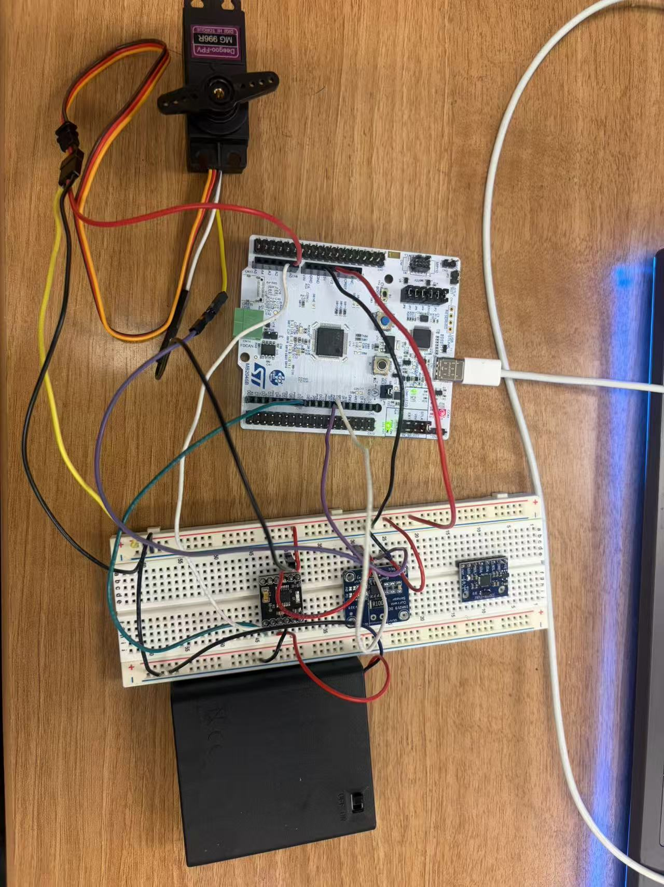

# HW16 – STM32 Servo Drive with ADC Feedback and INA219 Current Sensing

## Overview
This project uses the STM32 NUCLEO-C092RC to drive a modified RC servo motor and measure its behavior with both position and current feedback.

The system includes:
- ADC reading from the servo potentiometer
- PWM motor drive through a DRV8833 H-bridge
- INA219 current sensing over I2C
- a 1 kHz timer-based control structure
- safety limits based on potentiometer ADC values

The motor cycles through:
1. Forward
2. Off
3. Reverse
4. Off

During operation, the STM32 prints ADC position data, INA219 current data, and system state to the serial monitor.

---

## Hardware Setup

### Main components
- STM32 NUCLEO-C092RC
- Modified RC servo
- DRV8833 motor driver
- INA219 current sensor
- External battery supply for motor power
- Breadboard and jumper wires

### Hardware photo


---

## Wiring Summary

### Servo potentiometer
- Potentiometer output → `PA0` (`A0`)
- Potentiometer power → `3.3V`
- Potentiometer ground → `GND`

### DRV8833
- PWM output 1 → `PA8`
- PWM output 2 → `PA1`
- Driver enable / sleep → `3.3V`
- Driver ground → common `GND`
- Motor power → external battery supply

### INA219
- `SDA` → `PA6` (board connection used at `D12`)
- `SCL` → `PA7` (board connection used at `D11`)
- `VCC` → `3.3V`
- `GND` → `GND`

### Motor current path
The INA219 was inserted in series with the motor path so that motor current could be measured during both forward and reverse motion.

---

## Software Features
The final code includes:
- ADC sampling of the servo potentiometer
- INA219 register reads over I2C
- PWM motor control through TIM1
- timer-based periodic control using TIM2
- motor state switching
- ADC-based safety stop
- serial monitoring output

The timer structure is stable because the interrupt only handles timing, while sensor reads and serial printing are performed in the main loop.

---

## Safety Limits
The motor is stopped if the ADC reading moves outside the allowed range.

Example limits used in the final test:
- `ADC_MIN_LIMIT = 380`
- `ADC_MAX_LIMIT = 2600`

These values were chosen experimentally based on the real motion range of the modified servo.

---

## Example Serial Output

```text
[STATE=0] ADC=2154 | CFG=0x399F | SHUNT raw=1545 | BUS raw=0x00A2 | Shunt=15.45 mV | Current=154.50 mA
[STATE=1] ADC=1691 | CFG=0x399F | SHUNT raw=0 | BUS raw=0x05DA | Shunt=0.00 mV | Current=0.00 mA
[STATE=2] ADC=1530 | CFG=0x399F | SHUNT raw=-4657 | BUS raw=0x086A | Shunt=-46.57 mV | Current=-465.70 mA
